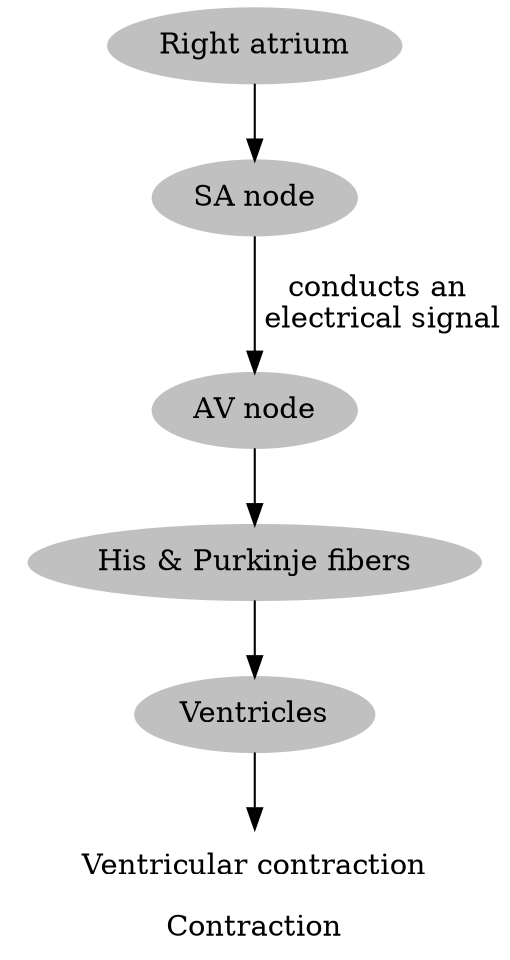

# Common Rhythms
## NSR 
![[Pasted image 20240219003045.png]]

| Rhythm | Rate | P Waves | PR Interval | QRS Complex |
| ---- | ---- | ---- | ---- | ---- |
| Regular | 60-100bpm | Normal | 12-20ms | 6-10ms |
## Sinus Bradycardia
![[Pasted image 20240219001339.png]]

| Rhythm | Rate | P Waves | PR Interval | QRS Complex |
| ---- | ---- | ---- | ---- | ---- |
| Regular | <60 bpm | Normal | Normal | Normal |
## Sinus Tachycardia
![[Premature Atrial Contraction.png]]

| Rhythm | Rate | P Waves | PR Interval | QRS Complex |
| ------ | ---- | ------- | ----------- | ----------- |
|        | 100-160 bpm     | - normal  - one P wave before each QRS complex        | 12-20ms            | 6-10ms            |
## Premature Atrial Contraction (PAC)
![[Pasted image 20240215162657.png]]

| Rhythm | Rate | P Waves | PR Interval | QRS Complex |
| ---- | ---- | ---- | ---- | ---- |
| single beat | Of underlying rhythm | - premature - abnormal in size, shape and direction | Of underlying rhythm | - Premature - normal duration (6-10ms) |
>[!cause]
>- Triggered by atrial myocardium not originating in the SA node
>- Can also be caused by $\beta$-agonists, digoxin, tricyclics, and potentially $\beta$-blockers
>- CAD and hypertrophic cardiomyopathy
>- Increased risk in px w/ MI, CHF, DM, COPD

>[!tx]
>- $\beta$-adrenergic blockers
>- Type IA, IC, III anti-arrythmic agents
## Atrial Flutter
![[Pasted image 20240218224039.png]]

| Rhythm | Rate | P Waves | PR Interval | QRS Complex |
| ---- | ---- | ---- | ---- | ---- |
| Regular or irregular (depends on AV conduction ratios) | - **Atrial Rate**: 250-400bpm - **Ventricular Rate**: less (counting QRS complexes) | Sawtooth waves ("flutter waves") on baseline | Not measurable | Normal |
>[!path]
>Originates in the right atria

>[!cause]
>- HF, Cardiac ischemia, myopathy
>- Surgery
>- Excessive drinking and stimulants

>[!tx]
>- $\beta$-blockers
>- cardioversion
## Ventricular Tachycardia
![[Pasted image 20240218224945.png]]

| Rhythm | Rate | P Waves | PR Interval | QRS Complex |
| ---- | ---- | ---- | ---- | ---- |
| Regular or slightly irregular | 140-250bpm (135-155 if vtach w/ pulse) | None | Not measurable | Wide (>12ms) |
>[!path]
>**Very dangerous**
>Coordinated ventricular contractions are replaced by very rapid but ineffective contractions $\rightarrow$ decreased ventricular filling $\rightarrow$ dramatic decrease in CO $\rightarrow$ absent pulse $\rightarrow$ leads to decreased oxygenation
>also AV dissociation

>[!cause]
>- Cardiac scarring
>- Too many PVCs
>- Electrolyte imbalances (hypokalemia, hypomagnesemia, hypocalcemia, hyperkalemia)
>- Cardiomyopathy
>- SWAN placement, post CABG

>[!tx]
>Cardioversion if pulseless
>IV vasopressors & antiarrythmics (such as amiodarone)
## Atrial Fibrillation
![[Pasted image 20240219000413.png]]

| Rhythm | Rate | P Waves | PR Interval | QRS Complex |
| ---- | ---- | ---- | ---- | ---- |
| Irregular | - **Atrial Rate**: ~400bpm - **Ventricular Rate**: Varies, but less than atrial rate | Irregular wave deflections on baseline | Not measurable | Normal |
>[!path]
>Abnormal electrical activity within the atria (irregular) $\rightarrow$ leads to turbulent and abnormal flow of blood through heart $\rightarrow$ decreased effeciveness in pumping blood & increased thrombus formation

>[!cause]
>- **atrial** ischemia
>- inflammation
>- chronic alcohol and drug use
>- **Risk Factors**: age, HTN, congenital heart disease

>[!sx]
>- SOB and lightheadedness
>- diaphoresis
>- palpitations and tachycardia

>[!tx]
>- control the rate (using CCBs or $\beta$-blockers)
>- anticoagulation
>- if unstable afib, cardioversion
>- if episodic and tachycardic, amiodarone (not first line)
## Ventricular Fibrillation
![[Pasted image 20240219000913.png]]
![[Pasted image 20240219001018.png]]

| Rhythm | Rate | P Waves | PR Interval | QRS Complex |
| ---- | ---- | ---- | ---- | ---- |
| Irregular | Not measurable (anywhere between 150 and 500) | Absent | Not measurable | Absent |
>[!path]
>When ventricular myocardium depolarizes erratically

>[!cause]
>- **Myocardial Ischemia**
>- Cardiac myopathy
>- Electrolyte imbalances (hyper and hypokalemia, hypomagnesemia)
>- Electricution accidents
>- Actual physical injury to the heart
>Can occur spontaneously or** preceded by PVCs**

>[!tx]
>CPR
>defribrilation (if no effect, administer epinephrine and amiodarone)
## Asystole
![[Pasted image 20240219002927.png]]

| Rhythm | Rate | P Waves | PR Interval | QRS Complex |
| ---- | ---- | ---- | ---- | ---- |
| If P waves are present, will have atrial rhythm | None | Will either have a P wave with no associated QRS complex or a straight one | Not measurable | Absent |
>[tx]
>CPR
>Epinephrine (check if fine vfib)
## Premature Ventricular Contraction (PVC)
![[Pasted image 20240219003148.png]]

| Rhythm | Rate | P Waves | PR Interval | QRS Complex |
| ---- | ---- | ---- | ---- | ---- |
| Not a rhythm, but a single beat | Underyling rhythm | None associated with PVC | Underlying rhythm | Premature and wide (>12ms) |
>[!cause]
>Heartbeat is initiated by Purkinje fibers rather than the SA node
>MI, HF
>Hypoxia
>Tobacco and caffeine
>Hypocalcemia and hypomagnesemia

>[!sx]
>Usually asymptomatic but can include vagal sx

>[!tx]
>If asymptomatic, usually no need for treatment
>If frequent and symptomatic, antiarrhythmics and $\beta$-blockers, and CCBs
## Paroxysmal Atrial Tachycardia (PAT)/Supraventricular Tachycardia (SVT)
![[Pasted image 20240219151550.png]]

| Rhythm | Rate | P Waves | PR Interval | QRS Complex |
| ---- | ---- | ---- | ---- | ---- |
| Regular | 140-250bpm | Abnormal (usually pointed), can be hidden in preceding T wave | Usually not measurable | Normal |
>[!path]
>Results from an electrolyte imbalance after an action potential. 
>Error occurs by a calcium influx (origins from another action potential) which causes depolarization. 
>If significant enough, another AP will occur.

>[!cause]
>- CHF
>- tobacco/alcohol
>- adenosine

>[!tx]
>First step is to determine hemodynamic stability. 
>**Stable**
>- IV $\beta$-blockers or CCBs
>
>**Unstable**
>- IV adenosine
>- Cardioversion

# Advanced Rhythms
## Bundle Branch Block
![[Pasted image 20240219180517.png]]
>[!path]
![[Pasted image 20240219180454.png]]
>SA node $\rightarrow$ AV node $\rightarrow$ bundle of His $\rightarrow$ left & right bundles
> If one is blocked, the not blocked one will depolarize first, causing a delay which causes a **wide QRS complex**

| Rhythm | Rate | P Waves | PR Interval | QRS Complex |
| ---- | ---- | ---- | ---- | ---- |
| Regular | Rate of underlying rhythm | Sinus | Normal | Wide (>12ms) |
### Right BBB 
Can be seen in healthy patients; can be temp or chronic
>[!tx]
>Control HTN or DM 
>Coronary angioplasty if coronary arteries are blocked
### Left BBB
Typically have to have chronic hypertensive heart disease
>[!path]
>Takes longer than normal for the left ventricle to fully depolarize

>[!tx]
>LBBB + syncope $\rightarrow$ pacemaker
>LBBB + prolonged QRS $\rightarrow$ biventricular pacemaker 
## Idioventricular Rhythm (IVR)
![[Pasted image 20240219184701.png]]

| Rhythm | Rate | P Waves | PR Interval | QRS Complex |
| ---- | ---- | ---- | ---- | ---- |
| Regular | IVR slow (30-40bpm) AIVR (>50bpm) | Absent | Not measurable | Wide (>12ms) |
>[!path]
>1. SA or AV node doesn't send a signal in a rate high enough (due to suppression with structural damage or functional dysfunction)
>2. Signal instead comes from the **ventricles** (assumes the role of the dominant pacemaker)

>[!tx]
>Chronic IVR usually leads to asystole, so treat the asystole. 
## Junctional Rhythm
![[Pasted image 20240219185013.png]]

>[!path]
>If SA node < AV node, then the AV node becomes the pacemaker

| Rhythm  | Rate                           | P Waves                                                          | PR Interval                            | QRS Complex |
| ------- | ------------------------------ | ---------------------------------------------------------------- | -------------------------------------- | ----------- |
| Regular | 40bpm Accelerated 60-100bpm | Inverted before QRS, immediately after QRS, or hidden within QRS | Short (0.10 second) or not meaesurable | Normal      |
## AV Heart Blocks
### First Degree AV Block
![[Pasted image 20240226180324.png]]

>[!path]
Injury to the AV note, which causes delayed impulses

>[!sx]
Typically asymptomatic.

| Rhythm  | Rate                      | P Waves | PR Interval           | QRS Complex |
| ------- | ------------------------- | ------- | --------------------- | ----------- |
| Regular | Rate of underlying rhythm | Regular | Consistent, Prolonged | Normal      |
### Second Degree AV Block 
#### Type 1 (Mobitz I)
![[Pasted image 20240227134727.png]]

>[!path]
>Blocked above the AV node
>Usually temporary and resolves on its own
>Usually caused by MI, hyperkalemia (can be normal and asymptomatic in people who are very athletic)

| Rhythm                                                | Rate                                                                                  | P Waves | PR Interval                                                    | QRS Complex |
| ----------------------------------------------------- | ------------------------------------------------------------------------------------- | ------- | -------------------------------------------------------------- | ----------- |
| Regular atrial rhythm Irregular ventricular rhythm | Atrial (rate of underlying rhythm) Ventricular (depends, usually less than atrial) | Normal  | Varies, progressively lengthens until a P wave isn't conducted | Normal      |
#### Type 2
![[Pasted image 20240227134923.png]]

>[!sx]
>Can progress to asystole

>[!tx]
>Based on heart rate and symptoms
>Permanent pacemaker
>>If they are hiccuping, the pacemaker needs to be redone

| Rhythm                                  | Rate                                                                                  | P Waves               | PR Interval                             | QRS Complex                                         |
| --------------------------------------- | ------------------------------------------------------------------------------------- | --------------------- | --------------------------------------- | --------------------------------------------------- |
| Regular Ventricular can be irregular | Atrial (rate of underlying rhythm) Ventricular (depends, usually less than atrial) | Sinus (2-3 more more) | Consistent (can be normal or prolonged) | Normal or wide (if wide, located below the AV node) |
### Third Degree AV Block
![[Pasted image 20240227135221.png]]

>[!path]
>Lyme disease or massive heart attack

>[!tx]
>Pacemaker

| Rhythm  | Rate                                                                                          | P Waves                                            | PR Interval             | QRS Complex     |
| ------- | --------------------------------------------------------------------------------------------- | -------------------------------------------------- | ----------------------- | --------------- |
| Regular | Atrial (rate of underlying rhythm) Ventricular (**SLOW** and always less than atrial rate) | Sinus with no constant relationship to QRS complex | Not consistent/variable | Normal or wideA |
![[Pasted image 20240227135336.png]]

# 12 Lead EKG
![[Pasted image 20240227135355.png|50]]
![[Pasted image 20240227135404.png]]

# Medications used in Code Blue
## Epinephrine
### for vfib
1 mg for adults
0.1 mg/kg for children (max 1mg)
0.01-0.03 mg/kg for neonates
## Atrophine
