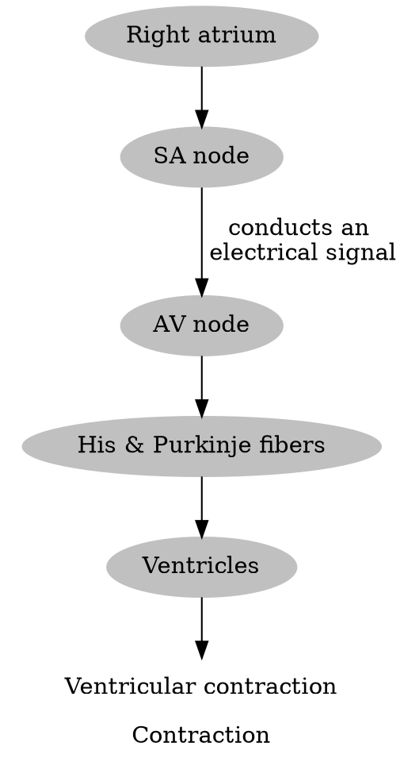
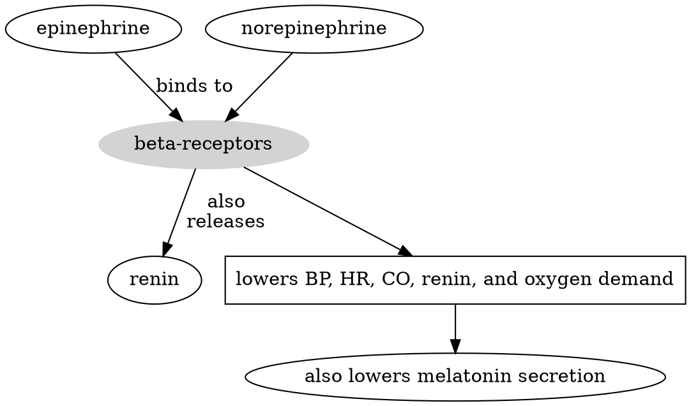

# Pathophysiology

# Antiarrhythmics
## Amiodarone
### Type
Class III Antiarrhythmic
Inhibits potassium receptor responsible for repolarizing the heart $\rightarrow$ $K^+$ CCB effect
### Results
$\uparrow$ action potential duration, prolonged effective refractory period.
### Administration
| IV | Oral |
| ---- | ---- |
| 150mg/10min 1mg/min/6hrs 0.5mg/min/18hrs | 800-1600mg/daily |
### Considerations
- Contraindicated in patients with: 2nd/3rd degree blocks w/out pacemakers, concurrent afib
- Make sure to monitor electrolytes
# $\beta$-blockers
(-lol)
Typically treats CV diseases, but also more uncommon things like long QT syndrome, hypertophic obstructive cardiomyopathy. 
### Mechanism of Action

