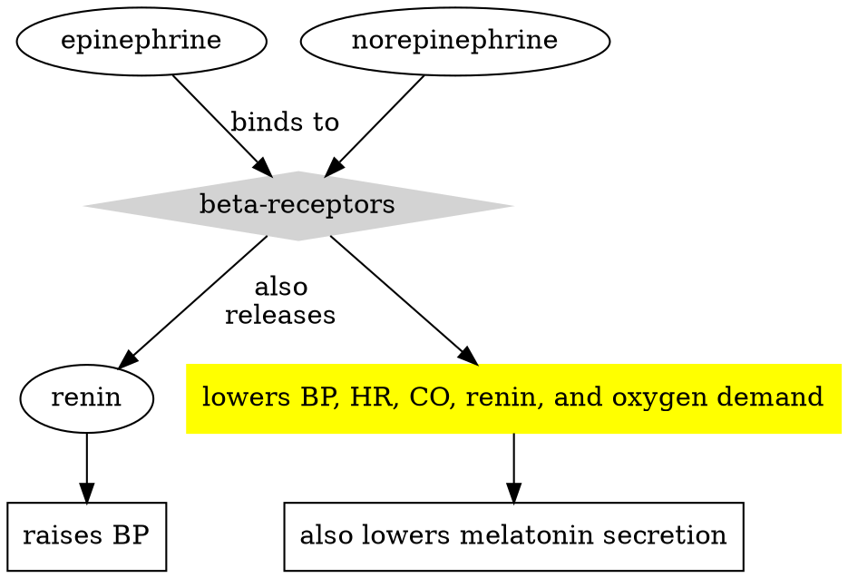

# Fibrinolytics
-ace 
Promotes fibrin dissolution
**Alteplase** - short half-life -- give over IV
**Tenecteplase, Reteplase** - longer half-lives, so can give as bolus over 5 min
## Uses
- STEMI/AMI
- DVT
- Pulmonary embolism
- Occlusioin of indwelling catheters, intracardiac thrombus formation
## Contraindications
- Hemorrhage
- Low platelet count
- Recent surgical procedure or trauma
## Nursing Management
- Check baseline labs (platelets, clotting times ie. PT/INR)
- Vitals q15/2hrs $\rightarrow$ q30/2hrs
- Frequent neuro checks
- Watch for s/s of bleeding (check skin integrity)
# Anticoagulants
## Types
Prevent clot formation
![[Review#PT/INR]]
### Unfractionated Heparin (UFH)
- Can only be given IV
- Indicated for ACS, venous thromboembolism, PCIs and patients who have received fibrinolytic therapy
- **Risks:** Narrow therapeutic range, increased bleeding risk, HIT and monitoring.
- **Contraindications:** if there is a noticable decrease in platelet count after receiving heparin
### Low Molecular Weight Heparin (LMWH)
- ie. Lovenox
- Derived from UFH; indicated for **unstable angina, NSTEMI, DVT**
- Longer half-life, predictable effects, administered subQ
- **Adverse Effects:** bleeding, thrombocytopenia, elevated liver enzymes, injection site complications
- Usually given when needing heparin therapy to take home
### Direct thrombin inhibitors
- ie. Angiomax, argatroban (typically given IV)
- Used in patients who have a history of HIT and are undergoing PCI
- Dosage based on aPTT results or ACT (activated clotting time)
## Important Medications
### Warfarin
Oral chronic anticoagulation therapy
Interferes with Vitamin K synthesis (vitamin K becomes the reversal agent)
INR levels can indicate effectiveness of Coumadin
Starting dose is 5mg/day
#### Indications
Heart failure, prosthetic valves, post AMI anticoagulation, VTE, cardiomyopathy
#### Contraindications
Uncontrolled hypertension, severe hepatic or renal impairment, if px is going to surgery soon
### Other
Direct oral anticoagulants are only FDA approved for afib 
ie. Eliquis
Andexxa is reversal agent! 

# Antiarrhythmics
### Amiodarone
#### Type
Class III Antiarrhythmic
Inhibits potassium receptor responsible for repolarizing the heart $\rightarrow$ $K^+$ CCB effect
#### Results
$\uparrow$ action potential duration, prolonged effective refractory period.
#### Administration
| IV | Oral |
| ---- | ---- |
| 150mg/10min 1mg/min/6hrs 0.5mg/min/18hrs | 800-1600mg/daily |
#### Considerations
- Contraindicated in patients with: 2nd/3rd degree blocks w/out pacemakers, concurrent afib
- Make sure to monitor electrolytes
# $\beta$-blockers
(-lol)
Typically treats CV diseases, but also more uncommon things like long QT syndrome, hypertophic obstructive cardiomyopathy. 
### Mechanism of Action

### Adverse Effects
May cause bradycardia and hypotension
(Not as common) bronchospasm, reduced circulation
### Contraindications
Patients with asthma, or chronic bradycardia or hypotension
### Considerations
>[!note]
>Monitor BP and QT intervals
>Overdose antidote is glucagon.

# Platelet Inhibitors
Indicated for ACS, post PCI with stenting, mechanical heart valves in combo with warfarin, acute ischemic stroke, stable angina, Kawasaki disease, afib with high risk of stroke, primary prevention of VTE
## Aspirin
- Inhibits Cox enxyme that inhibits platelet aggregrations
# Antiarrhythmics
Controls abnormal heart t