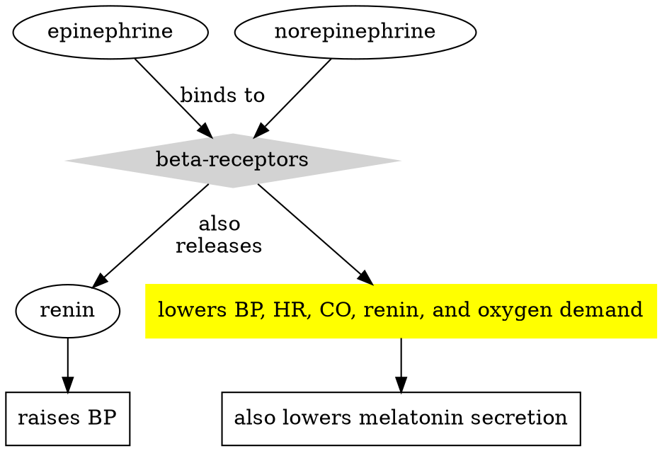

# Fibrinolytics
-ace 
Promotes fibrin dissolution
## Uses
- STEMI/AMI
- DVT
- Pulmonary embolism
- Occlusioin of indwelling catheters, intracardiac thrombus formation
## Contraindications
- Hemorrhage
- Low platelet count
- Recent surgical procedure or trauma
## Nursing Management
- Check baseline labs (platelets, clotting times ie. PT/INR)
- Vitals q15/2hrs $\rightarrow$ q30/2hr
# Antiarrhythmics
### Amiodarone
#### Type
Class III Antiarrhythmic
Inhibits potassium receptor responsible for repolarizing the heart $\rightarrow$ $K^+$ CCB effect
#### Results
$\uparrow$ action potential duration, prolonged effective refractory period.
#### Administration
| IV | Oral |
| ---- | ---- |
| 150mg/10min 1mg/min/6hrs 0.5mg/min/18hrs | 800-1600mg/daily |
#### Considerations
- Contraindicated in patients with: 2nd/3rd degree blocks w/out pacemakers, concurrent afib
- Make sure to monitor electrolytes
# $\beta$-blockers
(-lol)
Typically treats CV diseases, but also more uncommon things like long QT syndrome, hypertophic obstructive cardiomyopathy. 
### Mechanism of Action

### Adverse Effects
May cause bradycardia and hypotension
(Not as common) bronchospasm, reduced circulation
### Contraindications
Patients with asthma, or chronic bradycardia or hypotension
### Considerations
>[!note]
>Monitor BP and QT intervals
>Overdose antidote is glucagon.
	